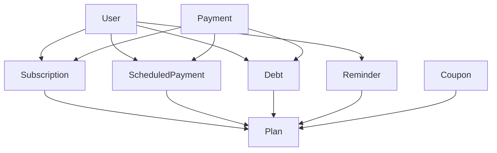

# Membership Management System - Complete Workflow

## Overview

The membership management system provides a comprehensive solution for managing memberships, payments, debts, reminders, and promotional campaigns. This system is designed to work seamlessly together, similar to Raklet.com, providing a complete membership management experience.

## Core Components

### 1. **Scheduled Payments**
- **Purpose**: Automate recurring payments for membership renewals
- **Features**:
  - Create scheduled payments with different frequencies (monthly, quarterly, yearly)
  - Automatic processing of due payments
  - Payment status tracking (pending, processed, failed, cancelled)
  - Integration with payment processors
  - Email notifications for payment events

### 2. **Debt Management**
- **Purpose**: Track outstanding amounts and manage debt collection
- **Features**:
  - Manual debt entry for late fees, penalties, or other charges
  - Automatic debt generation from failed payments
  - Debt status tracking (outstanding, paid, written_off)
  - Debt categorization (subscription, fee, penalty, other)
  - Outstanding debt summaries and reports

### 3. **Reminder System**
- **Purpose**: Automated communication with members
- **Features**:
  - Multiple reminder types (renewal, payment_due, overdue, welcome, custom)
  - Scheduled email reminders
  - Manual reminder sending
  - Reminder status tracking (pending, sent, failed)
  - Integration with email service

### 4. **Coupon & Discount System**
- **Purpose**: Promotional campaigns and member incentives
- **Features**:
  - Percentage and fixed amount discounts
  - Coupon validation and redemption tracking
  - Expiry dates and usage limits
  - Plan-specific coupon applicability
  - Coupon statistics and reporting

## Workflow Integration

### **Membership Lifecycle Management**

#### 1. **New Member Onboarding**
```
1. Member applies for membership → Application Form
2. Application approved → Subscription created
3. Welcome reminder sent → Reminder System
4. Initial payment processed → Payment System
5. Digital card generated → Digital Card System
```

#### 2. **Ongoing Membership Management**
```
1. Scheduled payments created → Scheduled Payment System
2. Payment due reminders sent → Reminder System
3. Failed payments create debts → Debt Management
4. Overdue reminders sent → Reminder System
5. Payment retry attempts → Scheduled Payment System
```

#### 3. **Promotional Campaigns**
```
1. Coupon created → Coupon System
2. Coupon applied to subscription → Discount calculation
3. Reduced payment amount → Payment System
4. Coupon redemption tracked → Coupon System
```

### **Payment Processing Workflow**

#### **Successful Payment Flow**
```
1. Scheduled payment due → Scheduled Payment System
2. Payment processed → Payment Processor Integration
3. Payment successful → Update subscription status
4. Confirmation email sent → Email Service
5. Next payment scheduled → Scheduled Payment System
```

#### **Failed Payment Flow**
```
1. Scheduled payment due → Scheduled Payment System
2. Payment fails → Payment Processor Integration
3. Debt created → Debt Management System
4. Failure reminder sent → Reminder System
5. Retry scheduled → Scheduled Payment System
```

### **Debt Collection Workflow**

#### **Automatic Debt Management**
```
1. Payment fails → Debt automatically created
2. Overdue reminder sent → Reminder System
3. Multiple reminders sent → Escalation process
4. Debt paid → Status updated to 'paid'
5. Subscription reactivated → Subscription System
```

#### **Manual Debt Management**
```
1. Admin creates manual debt → Debt Management
2. Debt notification sent → Reminder System
3. Payment received → Debt marked as 'paid'
4. Receipt generated → Payment System
```

### **Reminder Communication Workflow**

#### **Automated Reminder Schedule**
```
1. Renewal reminder (30 days before) → Reminder System
2. Payment due reminder (7 days before) → Reminder System
3. Overdue reminder (1 day after) → Reminder System
4. Final notice (7 days after) → Reminder System
5. Account suspension notice (14 days after) → Reminder System
```

#### **Custom Reminder Campaigns**
```
1. Admin creates custom reminder → Reminder System
2. Target audience selected → Member filtering
3. Reminder scheduled → Automated sending
4. Delivery status tracked → Reminder System
5. Follow-up actions triggered → Workflow integration
```

## Technical Implementation

### **Database Relationships**



### **API Endpoints Structure**

#### **Scheduled Payments**
- `GET /api/membership/scheduled-payments` - List all scheduled payments
- `POST /api/membership/scheduled-payments` - Create new scheduled payment
- `DELETE /api/membership/scheduled-payments/:id` - Delete scheduled payment
- `PATCH /api/membership/scheduled-payments/:id/status` - Update payment status
- `POST /api/membership/scheduled-payments/process` - Process due payments

#### **Debts**
- `GET /api/membership/debts` - List all debts
- `POST /api/membership/debts` - Create new debt
- `DELETE /api/membership/debts/:id` - Delete debt
- `PATCH /api/membership/debts/:id/status` - Update debt status
- `GET /api/membership/debts/outstanding-summary` - Get outstanding debt summary

#### **Reminders**
- `GET /api/membership/reminders` - List all reminders
- `POST /api/membership/reminders` - Create new reminder
- `DELETE /api/membership/reminders/:id` - Delete reminder
- `POST /api/membership/reminders/:id/send` - Send reminder manually
- `POST /api/membership/reminders/process` - Process due reminders

#### **Coupons**
- `GET /api/membership/coupons` - List all coupons
- `POST /api/membership/coupons` - Create new coupon
- `DELETE /api/membership/coupons/:id` - Delete coupon
- `PATCH /api/membership/coupons/:id` - Update coupon
- `POST /api/membership/coupons/validate` - Validate coupon
- `POST /api/membership/coupons/redeem` - Redeem coupon

### **Frontend Components**

#### **ScheduledPayments Component**
- Modal form for creating new scheduled payments
- List view with payment details and status
- Actions for editing and deleting payments
- Status indicators and due date highlighting

#### **Debts Component**
- Modal form for creating manual debts
- List view with debt details and status
- Bulk actions for debt management
- Outstanding debt summary dashboard

#### **Reminders Component**
- Modal form for creating custom reminders
- List view with reminder details and status
- Manual send functionality
- Reminder template management

#### **Coupons Component**
- Modal form for creating new coupons
- List view with coupon details and usage statistics
- Coupon validation and redemption tracking
- Coupon performance analytics

## Business Logic Integration

### **Payment Processing Logic**
```javascript
// When a scheduled payment is due
if (scheduledPayment.status === 'pending' && scheduledPayment.scheduledDate <= now) {
  // Attempt payment processing
  const paymentResult = await processPayment(scheduledPayment);
  
  if (paymentResult.success) {
    await scheduledPayment.update({ status: 'processed' });
    await sendPaymentConfirmation(scheduledPayment.user);
  } else {
    await scheduledPayment.update({ status: 'failed' });
    await createDebt(scheduledPayment); // Automatic debt creation
    await sendPaymentFailureReminder(scheduledPayment.user);
  }
}
```

### **Debt Management Logic**
```javascript
// When a payment fails
async function createDebtFromFailedPayment(payment) {
  const debt = await Debt.create({
    amount: payment.amount,
    description: `Failed payment for ${payment.plan.name}`,
    dataType: 'subscription',
    userId: payment.userId,
    planId: payment.planId,
    subscriptionId: payment.subscriptionId,
    status: 'outstanding'
  });
  
  // Create overdue reminder
  await createReminder({
    name: 'Payment Overdue',
    type: 'overdue',
    reminderDate: new Date(Date.now() + 24 * 60 * 60 * 1000), // 1 day later
    message: `Your payment of $${payment.amount} is overdue. Please update your payment method.`,
    userId: payment.userId
  });
}
```

### **Reminder Processing Logic**
```javascript
// Process due reminders
async function processDueReminders() {
  const dueReminders = await Reminder.findAll({
    where: {
      status: 'pending',
      reminderDate: { [Op.lte]: new Date() }
    }
  });
  
  for (const reminder of dueReminders) {
    try {
      await sendEmail(reminder.user.email, reminder.message);
      await reminder.update({ status: 'sent' });
    } catch (error) {
      await reminder.update({ status: 'failed' });
    }
  }
}
```

### **Coupon Validation Logic**
```javascript
// Validate coupon for a specific plan and amount
async function validateCoupon(couponId, planId, amount) {
  const coupon = await Coupon.findOne({ where: { couponId } });
  
  if (!coupon || !coupon.isActive) {
    throw new Error('Invalid or inactive coupon');
  }
  
  if (coupon.expiryDate && new Date(coupon.expiryDate) < new Date()) {
    throw new Error('Coupon has expired');
  }
  
  if (coupon.maxRedemptions && coupon.currentRedemptions >= coupon.maxRedemptions) {
    throw new Error('Coupon usage limit reached');
  }
  
  // Calculate discount
  const discountAmount = coupon.discountType === 'percentage' 
    ? (amount * coupon.discount) / 100 
    : coupon.discount;
  
  return {
    coupon,
    discountAmount,
    finalAmount: Math.max(0, amount - discountAmount)
  };
}
```

## User Experience Flow

### **Admin Dashboard**
1. **Overview Dashboard**: Shows key metrics for all systems
2. **Scheduled Payments**: Manage recurring payments
3. **Debt Management**: Track and manage outstanding amounts
4. **Reminder Center**: Create and manage communication campaigns
5. **Coupon Management**: Create and track promotional campaigns

### **Member Experience**
1. **Payment Management**: View and manage scheduled payments
2. **Debt Tracking**: View outstanding amounts and payment history
3. **Communication Center**: Receive and view reminders
4. **Coupon Usage**: Apply and track discount coupons

## Benefits of Integrated System

### **For Organizations**
- **Automated Operations**: Reduces manual work in payment processing
- **Improved Cash Flow**: Better tracking of payments and debts
- **Enhanced Communication**: Automated member engagement
- **Revenue Optimization**: Promotional campaigns and discount management
- **Comprehensive Reporting**: Full visibility into membership operations

### **For Members**
- **Convenient Payments**: Automated recurring payments
- **Clear Communication**: Timely reminders and notifications
- **Transparent Billing**: Clear view of charges and payments
- **Value Benefits**: Access to promotional offers and discounts
- **Self-Service**: Ability to manage their own accounts

## Conclusion

This integrated membership management system provides a complete solution for organizations to manage their memberships effectively. By combining scheduled payments, debt management, reminder systems, and promotional campaigns, it creates a seamless experience for both administrators and members, similar to professional platforms like Raklet.com.

The system is designed to be scalable, maintainable, and user-friendly, with comprehensive API endpoints and intuitive frontend components that work together to provide a complete membership management experience.
