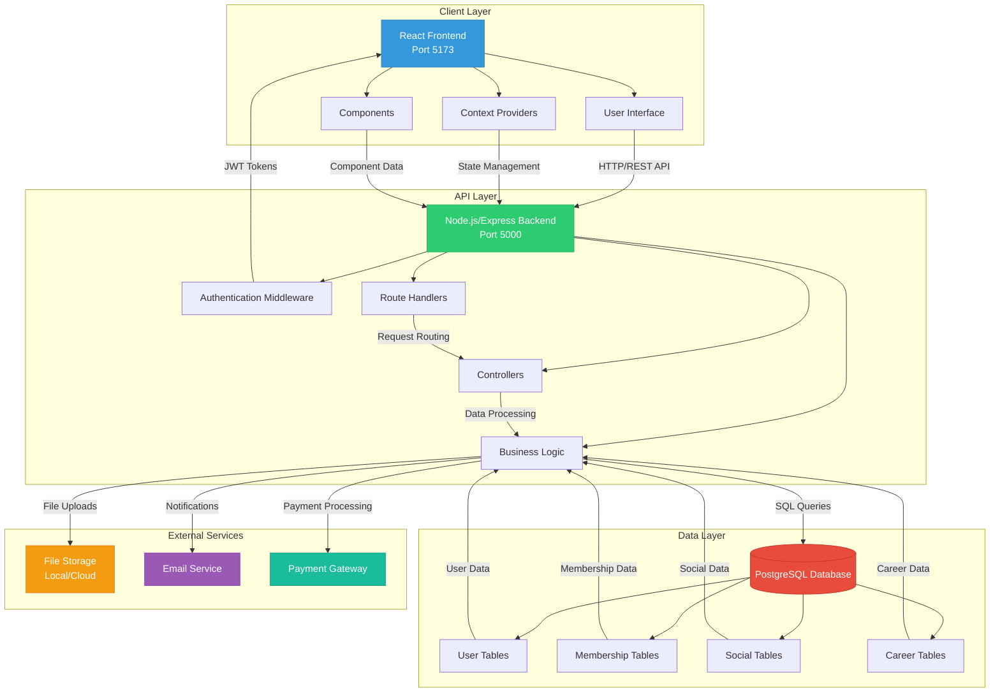
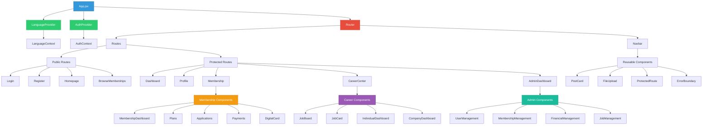
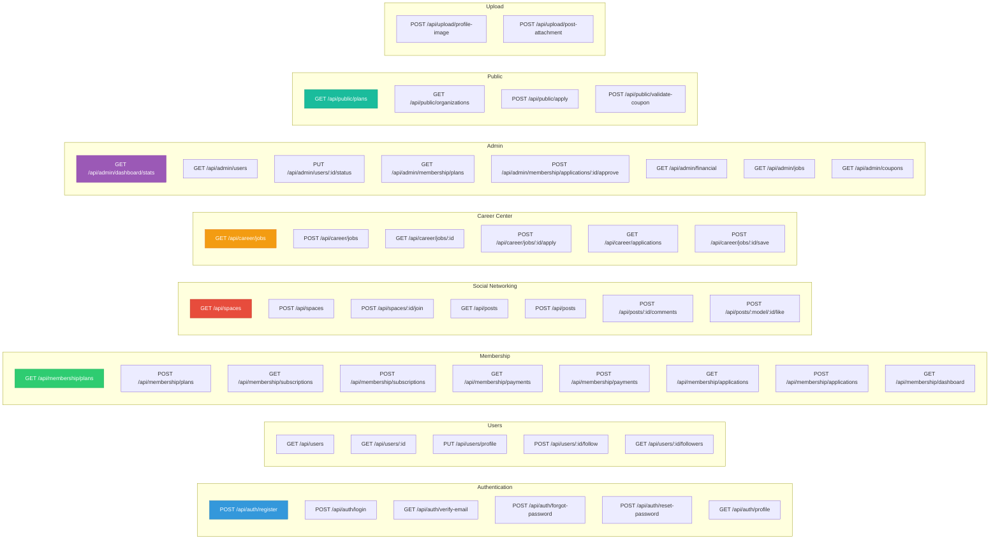
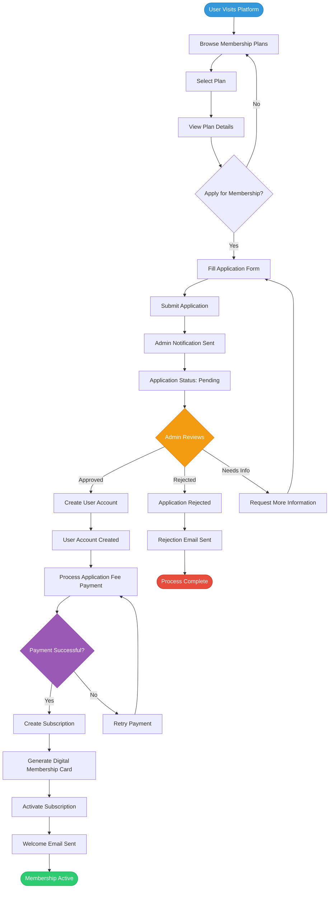
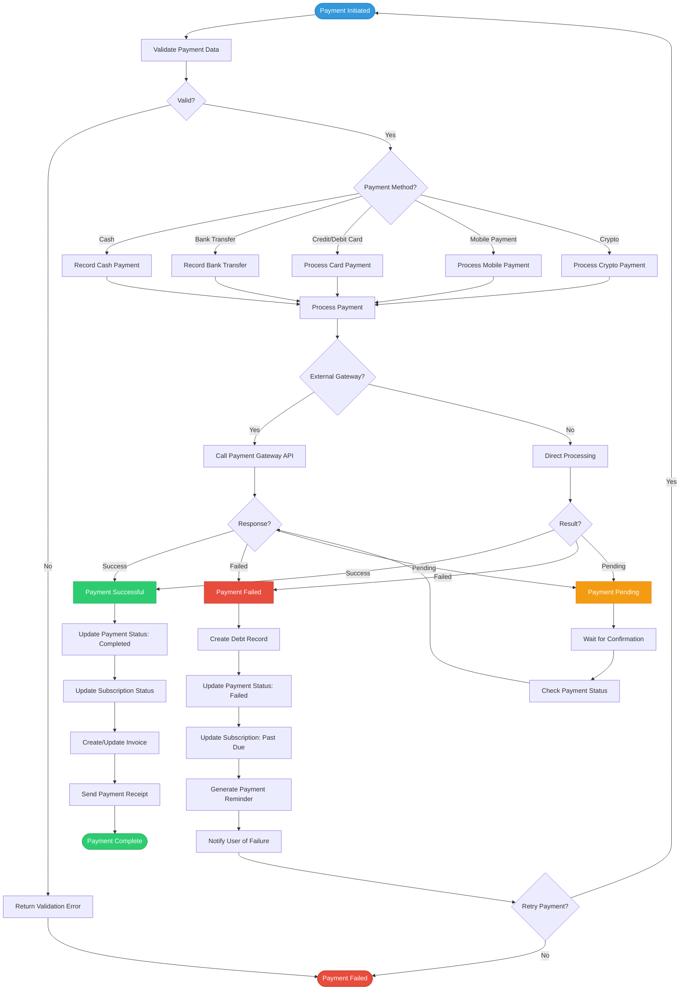
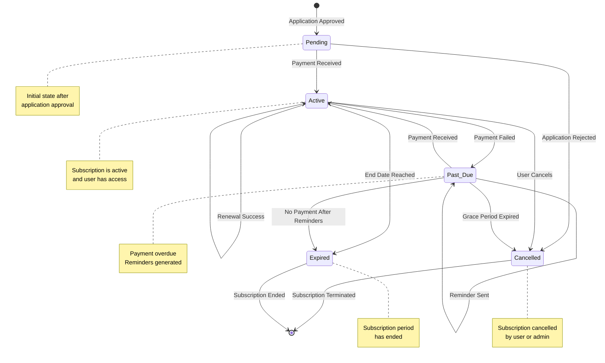

# Project Diagrams

This document contains all system diagrams for the SaaS Platform project. These diagrams can be rendered using Mermaid in markdown viewers or exported as images.

---

## 1. System Architecture Diagram



---

## 2. Component Hierarchy



---

## 3. API Endpoint Map



---

## 4. Membership Application Workflow



---

## 5. Payment Processing Workflow



---

## 6. Subscription Lifecycle



---

## Diagram Usage Instructions

### Rendering Mermaid Diagrams

1. **In Markdown Viewers:**
   - GitHub, GitLab, and many markdown viewers support Mermaid natively
   - Simply include the code blocks in your markdown file

2. **In VS Code:**
   - Install the "Markdown Preview Mermaid Support" extension
   - Preview the markdown file to see rendered diagrams

3. **Online Tools:**
   - Copy the Mermaid code to [Mermaid Live Editor](https://mermaid.live)
   - Export as PNG, SVG, or PDF

4. **Export as Images:**
   - Use [Mermaid CLI](https://github.com/mermaid-js/mermaid-cli) to generate images
   - Or use online tools to convert to PNG/SVG

### Integration with PROJECT_REPORT.md

To include these diagrams in your project report, you can:

1. **Option 1:** Reference this file in the report
2. **Option 2:** Copy individual diagram code blocks into the report
3. **Option 3:** Export diagrams as images and reference them as screenshots

Example reference in PROJECT_REPORT.md:
```markdown
**System Architecture Diagram**
- **Mermaid Code**: See `PROJECT_DIAGRAMS.md` section 1
- **Description**: High-level architecture diagram showing...
```

---

## Notes

- All diagrams are created based on the current project structure
- Diagrams reflect actual routes, components, and workflows
- Colors are consistent with the project's color scheme (#3498db, #2ecc71, etc.)
- Diagrams can be customized by modifying the Mermaid code
